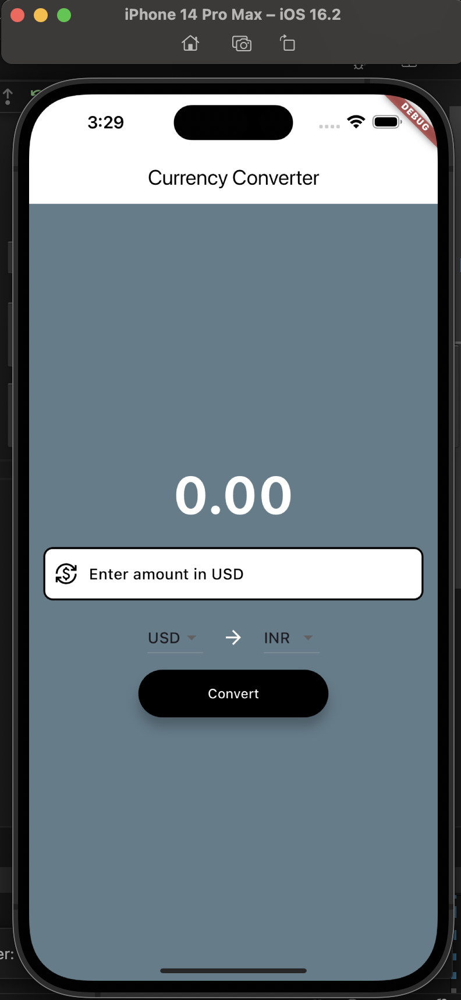
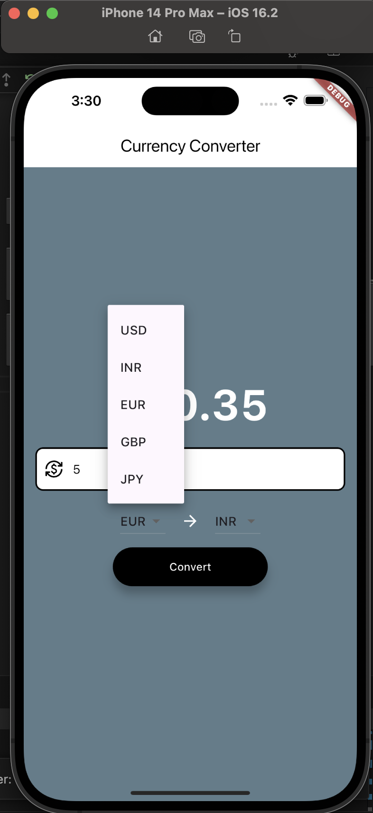
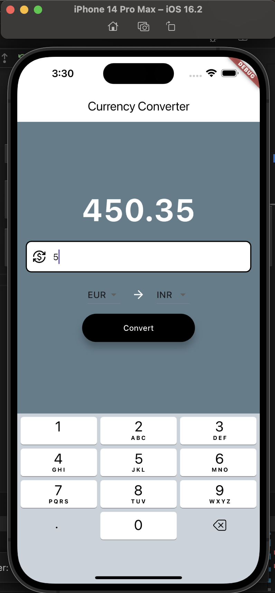

# Currency Converter App

This is a simple currency converter app built with **Flutter**. It utilizes the **Exchangerate API** to fetch real-time exchange rates and allows users to convert currencies between various countries.

**Features:**

* **Real-time exchange rates:** Get the latest exchange rates directly from the Exchangerate API.
* **Multiple currency options:** Convert between a wide range of supported currencies.
* **User-friendly interface:** Intuitive and modern UI designed with Flutter's Material Design components.
* **Offline support:** Store recent exchange rates for offline conversions.

# Screenshots

  
  
  

